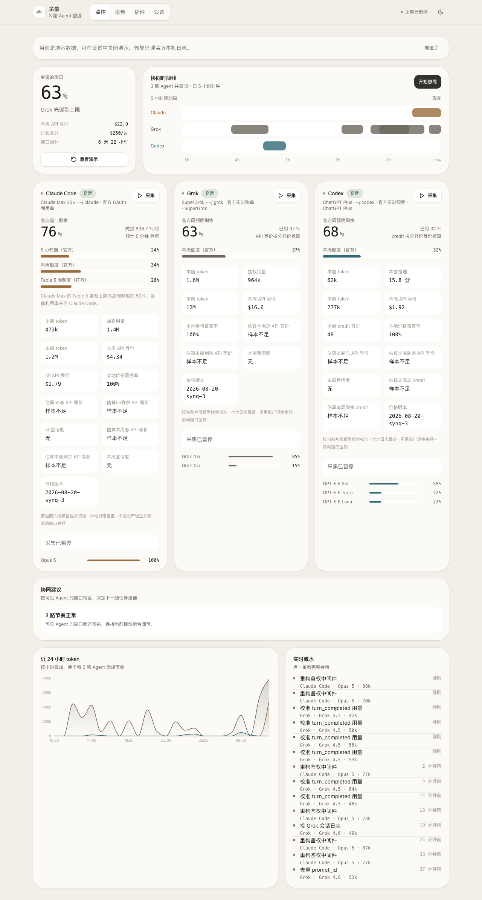
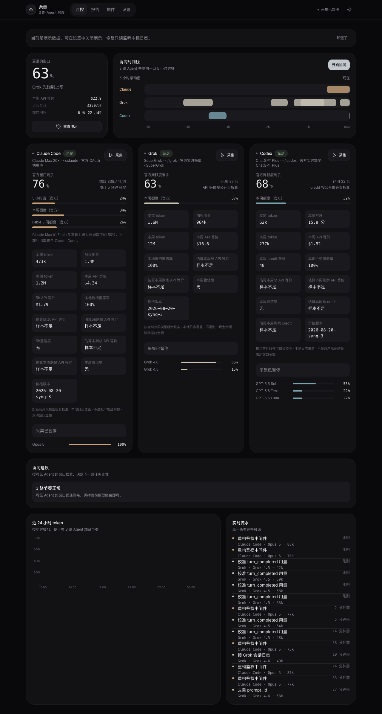
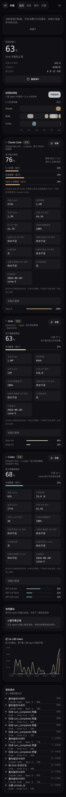

# 余量 / Balance

余量（Balance）是一个本地优先的 Claude Code、Grok CLI / Grok Build 和 Codex CLI 配额监控面板。它读取本机 Agent 会话日志和供应商官方订阅百分比，把实际模型/token 用量折算成公开 API 价格等价。

> “API 等价金额”表示同样模型与 token 通过公开 API 调用时的理论价格，不是现金余额，也不是供应商承诺的可提现额度。

## 界面预览

亮色与暗色可在应用内切换。








## 本地运行

需要 Node.js 22 或更高版本。

```bash
npm install
npm run dev
```

打开 <http://localhost:8080>。余量必须运行在保存 Claude / Grok / Codex 本地日志的机器上，才能自动读取真实用量；没有本地数据时仍可使用匿名演示数据，或在「插件」页手动导入 JSON/JSONL。

```bash
npm test
npm run typecheck
npm run build
```

## macOS 应用

从 GitHub Actions 下载名为 `Balance-macos-arm64` 的构件，解压 `Balance-macos-arm64.app.zip` 或打开其中的 DMG 后启动。当前构建使用 macOS ad-hoc 签名，从网络下载后首次打开可能出现系统安全提示。维护者构建与验收见 [macOS 桌面应用](./docs/macos-desktop.md)。

## 从 Synq 升级

Balance 是 Synq 的原地品牌升级。桌面应用继续使用 bundle identifier `com.synq.desktop`、固定 origin `127.0.0.1:4780` 和持久化 key `synq-quota-v8`；官方成功快照仍位于 `~/Library/Application Support/Synq/official-quota.json`。因此覆盖安装后，既有套餐、阈值、采样设置和最后一次官方额度快照会继续可用。

## 数据与隐私

Claude、Grok、Codex 分别读取本机 `~/.claude`、`~/.grok`（或 `$GROK_HOME`）、`~/.codex`（或 `$CODEX_HOME`）中的会话日志，再叠加各供应商官方订阅百分比。金额分层与计价规则见 [订阅配额 API 等价金额算法](./docs/subscription-quota-value-algorithm.md)。

- access token 只在服务端读取，不进入浏览器状态，也不写入持久化样本。
- 不要提交 `~/.claude`、`~/.grok`、`~/.codex`、auth 文件或真实导出日志。
- 远端部署无法读取访问者电脑上的本地 Agent 文件。
- 仓库自带的 Claude 演示数据已经匿名化。

## 许可证

[MIT](./LICENSE)
